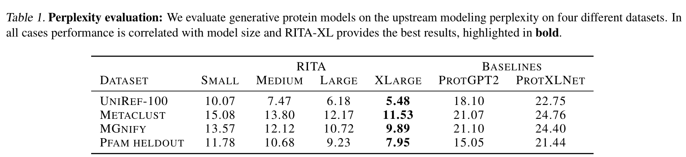

#  RITA: a Study on Scaling Up Generative Protein Sequence Models

[](LICENSE)  [](https://twitter.com/LightOnIO)

RITA is a family of autoregressive protein models, developed by a collaboration of [Lighton](https://lighton.ai/), the [OATML group](https://oatml.cs.ox.ac.uk/) at Oxford, and the [Debbie Marks Lab](https://www.deboramarkslab.com/) at Harvard. 

Model | #Params | d_model | layers | lm loss uniref-100
--- | --- | --- | --- | --- | 
[Small](https://huggingface.co/lightonai/RITA_s) | 85M  | 768 | 12 | 2.31
[Medium](https://huggingface.co/lightonai/RITA_m) | 300M | 1024 | 24 | 2.01
[Large](https://huggingface.co/lightonai/RITA_l)| 680M | 1536 | 24 | 1.82
[XLarge](https://huggingface.co/lightonai/RITA_xl)| 1.2B | 2048 | 24 | 1.70 

## Results
<p align="center">

</p>

For full results see our preprint: https://arxiv.org/abs/2205.05789
## Usage 
Instantiate a model like so:
``` python
from transformers import AutoModel, AutoModelForCausalLM
model = AutoModelForCausalLM.from_pretrained("lightonai/RITA_s", trust_remote_code=True)
tokenizer = AutoTokenizer.from_pretrained("lightonai/RITA_s")
```
for generation we support pipelines:
``` python
from transformers import pipeline
rita_gen = pipeline('text-generation', model=model, tokenizer=tokenizer)
sequences = rita_gen("MAB", max_length=20, do_sample=True, top_k=950, repetition_penalty=1.2, 
                     num_return_sequences=2, eos_token_id=2)
for seq in sequences:
    print(f"seq: {seq['generated_text'].replace(' ', '')}")
```
Or see `example.py`

## How to cite    

    @article{hesslow2022rita,
      title={RITA: a Study on Scaling Up Generative Protein Sequence Models},
      author={Hesslow, Daniel and Zanichelli, Niccol{\'o} and Notin, Pascal and Poli, Iacopo and Marks, Debora},
      journal={arXiv preprint arXiv:2205.05789},
      year={2022}
    }
